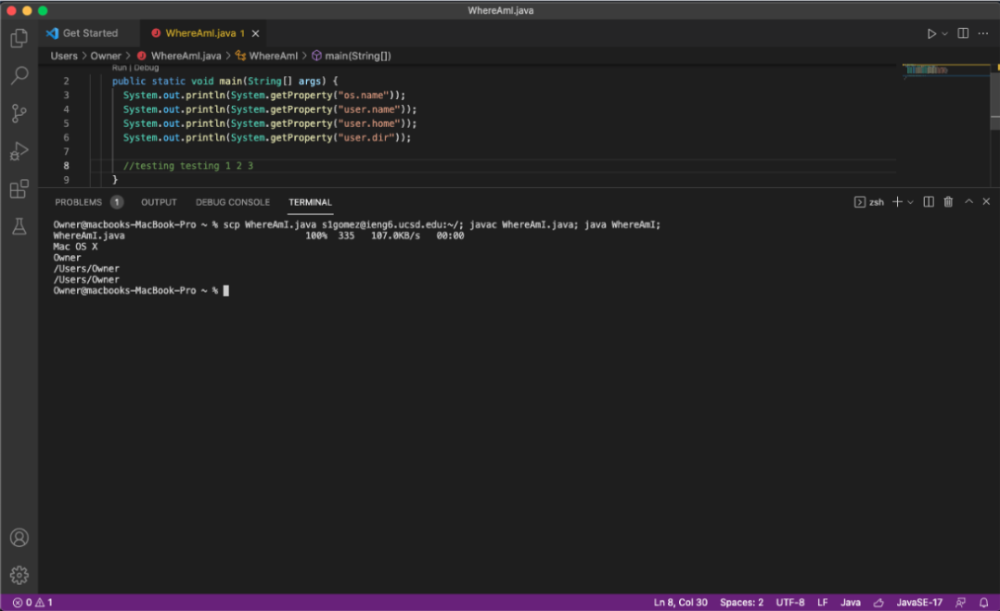

Here is the lab report for the first official in person lab !!

1. The first step is to install Visual Studio Code! For this step, I just went to [VSCode] (https://code.visualstudio.com/) website and downloaded the version for my operating system (OSX).
--> The image below shows what VS Code will probably look like once you open it up. 

2. The second step is to remotely connect to the remote account you will be using! My cs15lfa22 account isn't working at the moment so I used my other account for this lab, but as you can see, I used the command ssh (which stands for secure shell), then the account name and @ieng6.ucsd.edu, in order to access it. 

--> When you log in, it will prompt you for your password, if you are using ur cs15lfa22 account, you should have changed it by this point. You want see any feedback while you are typing it in, but it should let you log in as long as you type in the right password. 

3. Trying the Commands!

4. Moving Files!

5. Setting an SSH Key!!

6. Optimizing Remote Building

