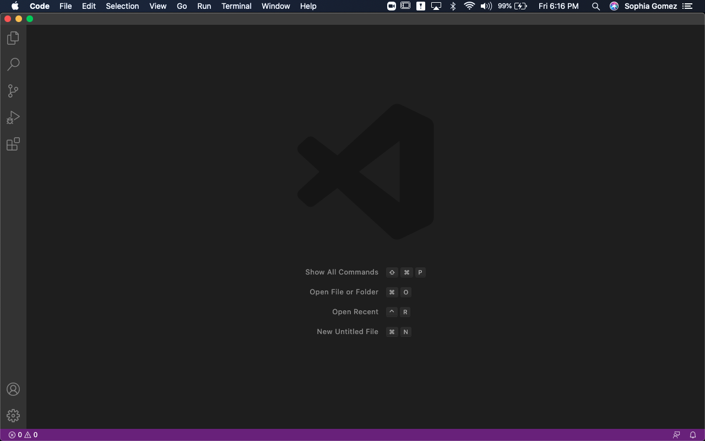
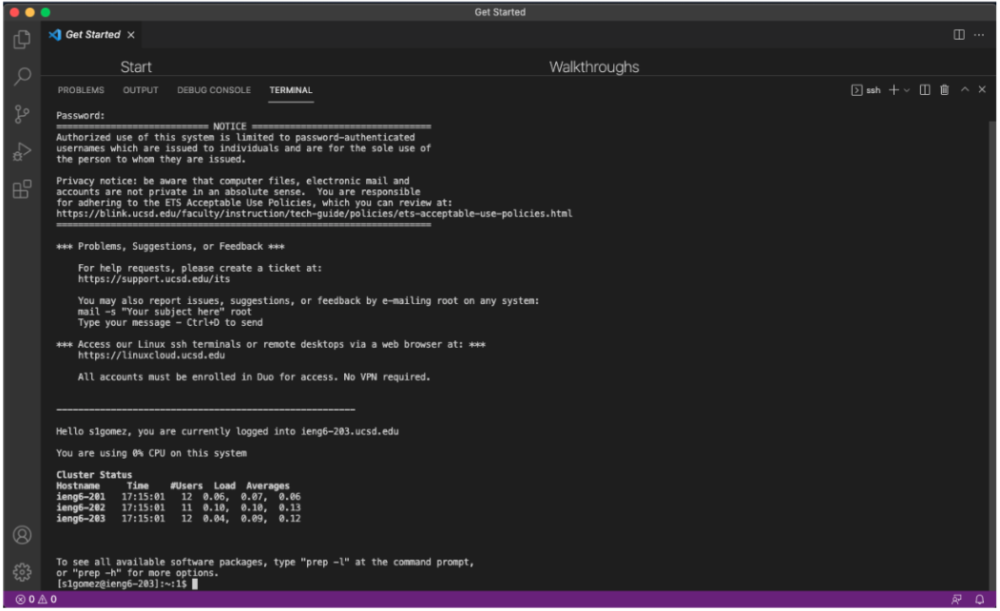
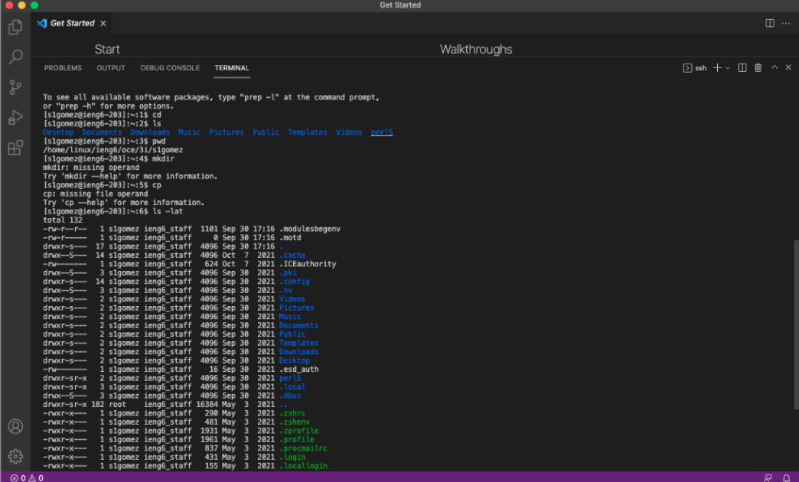
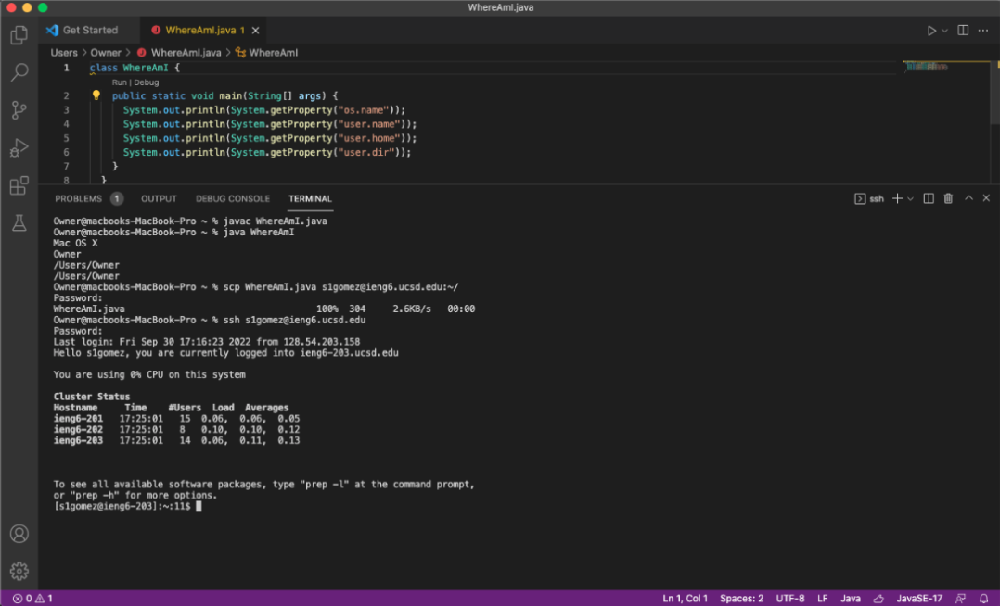
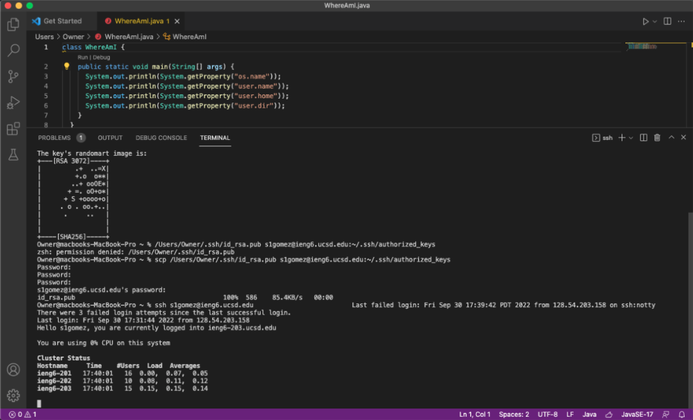
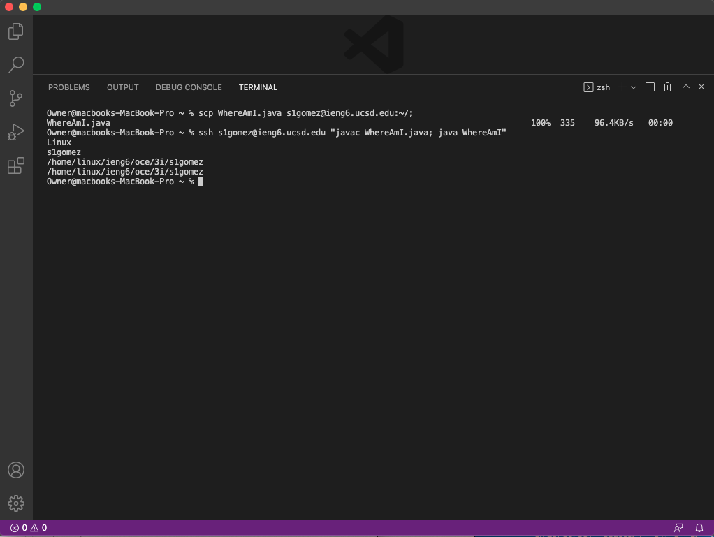

Here is the lab report for the first official in person lab !!

1. The first step is to install Visual Studio Code! For this step, I just went to [VSCode] (https://code.visualstudio.com/) website and downloaded the version for my operating system (OSX).

The image below shows what VS Code will probably look like once you open it up. 

2. The second step is to remotely connect to the remote account you will be using! My cs15lfa22 account isn't working at the moment so I used my other account for this lab, but as you can see, I used the command ssh (which stands for secure shell), then the account name and @ieng6.ucsd.edu, in order to access it. 

When you log in, it will prompt you for your password, if you are using ur cs15lfa22 account, you should have changed it by this point. You want see any feedback while you are typing it in, but it should let you log in as long as you type in the right password. 

3. Trying the Commands! After you're able to log in, you should be able to run commands on the remote server now!! You can see cd, ls, pwd, ls-lat, and more. Each of these commands does different things, pwd, for example, stands for "print working directory" which then returns the current working directory.

4. Moving Files! In this step, you learn how to move files from your local client (the computer you are using), to the remote server (the account you log into and access). As you can see in the image below, you use the code scp (secure copy), the name of the file you want to transfer (which in this case is WhereAmI.java), and the server you want to transfer it to. 

You should be able to see a line where it gives you the name of the code, the percentage transferred, the number of characters in the file, and a few more things. 

5. Setting an SSH Key!! Now, you will see how I made it so that I wouldn't have to retype my password everytime I log into the remote account. This can be done using the command ssh-keygen, creating a public key and private key. For this step you can see the commands needed to in order to achieve that. Based on the information given in the lab instructions, what it does is essentially create two files, the private key (id_rsa), and the public key (id_sra.pub. The public key is copied to the server, and the privete ket is on the client, and ssh uses the two files instead of the password. 

6. Optimizing Remote Building. I wasn't sure if I did this correctly but the objective of this task was to make to most "pleasant process" for making an edit to WhereAmI.java and then copying the file to the remote server and running it. 

The commands I used to do this was scp WhereAmI.java s1gomez@ieng6.ucsd.edu~/ which was easily accessed using the up arrow from when I had previously typed it out, and then ssh s1gomez@ieng6.ucsd.edu "javac WhereAmI.java; java WhereAmI" and that seemed to work? I bascially just copy the file, and in the second command I logged in and compiled/ran the file.

