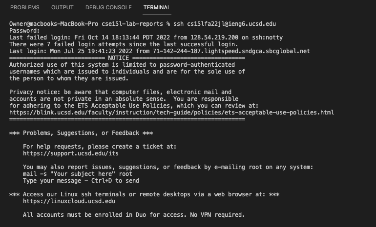
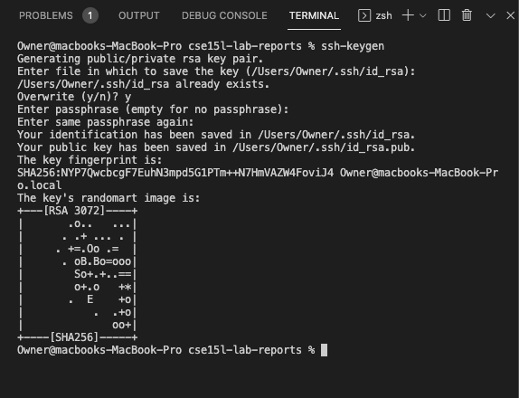
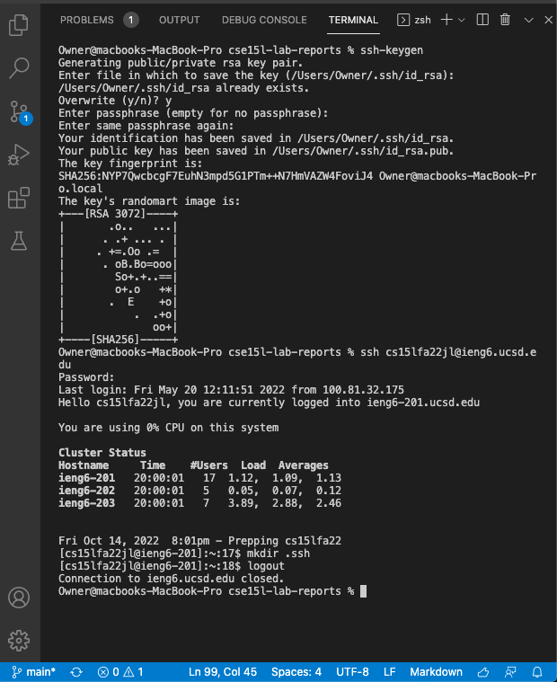
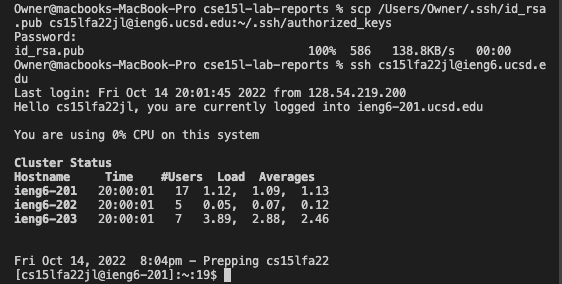

Here is the lab report for the first official in person lab !!

1.The first step is to install Visual Studio Code! For this step, I just went to [VSCode](https://code.visualstudio.com/) website and downloaded the version for my operating system (OSX).

The image below shows what VS Code will probably look like once you open it up. 


2.The second step is to remotely connect to the remote account you will be using! As you can see, I used the command ssh (which stands for secure shell), then the account name and @ieng6.ucsd.edu, in order to access it. 

In my case, this looked like:

```ssh s1gomez@ieng6.ucsd.edu```

Now that my account works, I will be using:

```ssh cs15lfa22jl@ieng6.ucsd.edu```



When you log in, it will prompt you for your password, if you are using ur cs15lfa22 account, you should have changed it by this point. You won't see any feedback while you are typing it in, but it should let you log in as long as you type in the right password. 


3.Trying the Commands! After you're able to log in, you should be able to run commands on the remote server now!! You can see cd, ls, pwd, ls-lat, and more. Each of these commands does different things, pwd, for example, stands for "print working directory" which then returns the current working directory.


4.Moving Files! In this step, you learn how to move files from your local client (the computer you are using), to the remote server (the account you log into and access). As you can see in the image below, you use the code scp (secure copy), the name of the file you want to transfer (which in this case is WhereAmI.java), and the server you want to transfer it to. 

```scp WhereAmI.java cs15lfa22jl@ieng6.ucsd.edu:~/```

You should be able to see a line where it gives you the name of the code, the percentage transferred, the number of characters in the file, and a few more things. 

(In the Image above you will see me using my personal account so the screenshot above shows me transferring the file using 

```scp WhereAmI.java s1gomez@ieng6.ucsd.edu:~/```

but the basics are still the same thing)

)

5.Setting an SSH Key!! Now, you will see how I made it so that I wouldn't have to retype my password everytime I log into the remote account. This part is a little more confusing so just follow along. 

First, you type this command into the terminal

```ssh-keygen``` 

This creates a public key and private key.

You will then be prompted to enter the file in which to save the key. Which then you will type in the specific file for your local computer. In my case, I typed out 

```/Users/Owner/.ssh/id_rsa```

That is pretty much the default path, if you don't want to type it all out, you can just press enter again to specifiy the default path. 

It will then prompt you to create a passphrase, or leave it empty for no passphrase. This basically just saves the private key onto a location on the client (your computer).

It will let you know your identification/public key has been saved, and give you a key fingerprint and the key's randomart image. 

Now, you just need to copy the public key on the .ssh directory of your account on the remote server. 

To do this, you will first ssh into your remote account and enter your password. 

```ssh cs15lfa22jl@ieng.ucsd.edu```

Then, once you're on the remote server you will type in:

```mkdir .ssh```

This is the command that makes the .ssh directory that you will be copying the public key into. (mkdir stands for make directory). If your account tells you that the directory already exists, don't worry about it, and move onto the next step. After you log out, and  once you're back on the client, you will copy the file with the public key onto the remote account:

In my case, I put down: 

```scp /Users/Owner/.ssh/id_rsa.pub cs15lfa22jl@ieng6.ucsd.edu:~/.ssh/authorized_keys ```

After this, you should be able to log into your remote account without inputting your password!!!


Based on the information given in the lab instructions, what it does is essentially create two files, the private key (id_rsa), and the public key (id_sra.pub). The public key is copied to the server, and the privete key is on the client, and ssh uses the two files instead of the password to log in. 

Below are images to help you follow these steps if you have any questions on what you should be looking at, as well as how it looks once you have the key set up !!






6.Optimizing Remote Building. I wasn't sure if I did this correctly but the objective of this task was to make to most "pleasant process" for making an edit to WhereAmI.java and then copying the file to the remote server and running it. 

The commands I used to do this was 


```scp WhereAmI.java s1gomez@ieng6.ucsd.edu~/ ```

which was easily accessed using the up arrow from when I had previously typed it out, and then 

```ssh s1gomez@ieng6.ucsd.edu "javac WhereAmI.java; java WhereAmI"```

and that seemed to work? I basically just copy the file, and in the second command I logged in and compiled/ran the file.


And that's it!! Hopefully it works for you!!