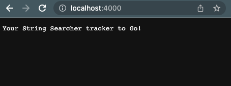
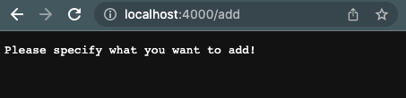
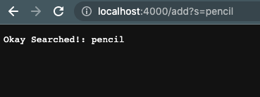
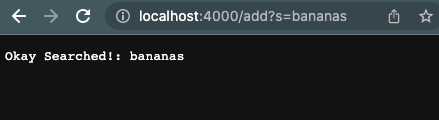
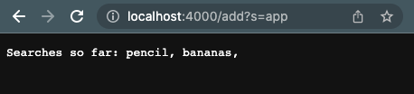
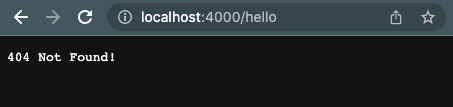
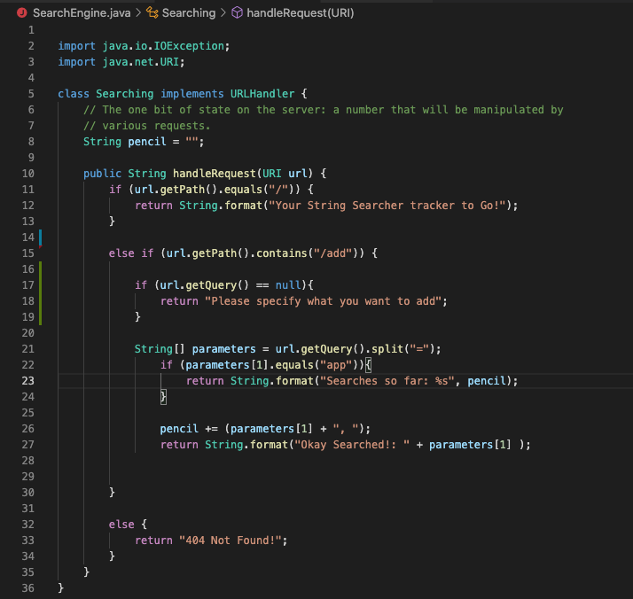
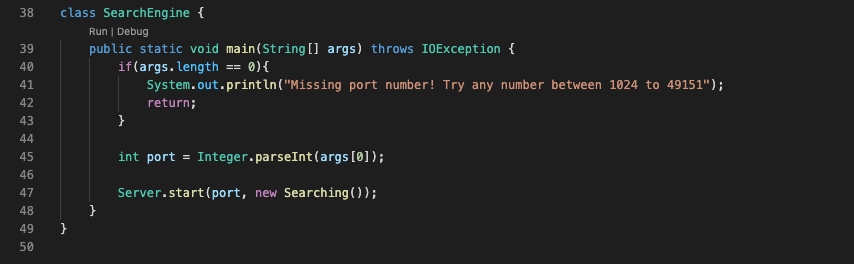
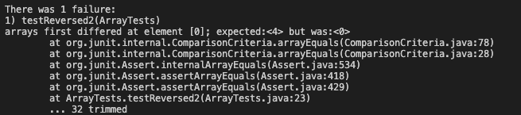
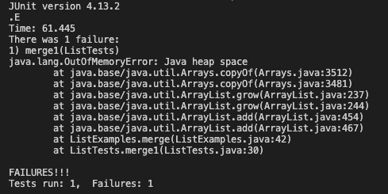

Part 1:












Explain:
(Which methods in your code are called)

(What the values of the relevant arguments to those methods are, and the values of any relevant fields of the class.)

(If those values change, how they change by the time the request is done processing)


```
import java.io.IOException;
import java.net.URI;

class Searching implements URLHandler {
    // The one bit of state on the server: a number that will be manipulated by
    // various requests.
    String pencil = "";

    public String handleRequest(URI url) {
        if (url.getPath().equals("/")) {
            return String.format("Your String Searcher tracker to Go!");
        } 
        
        else if (url.getPath().contains("/add")) {

            if (url.getQuery() == null){
                return "Please specify what you want to add";
            }

            String[] parameters = url.getQuery().split("=");
                if (parameters[1].equals("app")){
                    return String.format("Searches so far: %s", pencil);
                }

                pencil += (parameters[1] + ", ");
                return String.format("Okay Searched!: " + parameters[1] );
            
            
        } 
        
        else {
            return "404 Not Found!";
        }
    }
}

class SearchEngine {
    public static void main(String[] args) throws IOException {
        if(args.length == 0){
            System.out.println("Missing port number! Try any number between 1024 to 49151");
            return;
        }

        int port = Integer.parseInt(args[0]);

        Server.start(port, new Searching());
    }
}
```


Part Two:

Failure-Inducing Input (Code of the Test)
Symptom (The failing test output)
Bug (The code fix needed)
(Explain the connection between the symptom and the bug. Why does the bug cause that particular symptom for that particular input)


ArrayExamples.java

Code:
```
static int[] reversed(int[] arr){
   int [] newArray = new int[arr.length];
   for (int i = 0; i < arr.length; i += 1){
     arr[i] = newArray[arr.length-i-1];
  }
  return arr;
  }
```


Failure-Inducing Input:

```
@Test
public void testReversed2(){
  int[] input1 = {1, 2, 3, 4};
  assertArrayEquals(new int[] {4, 3, 2, 1},ArrayExamples.reversed(input1));
}
```

Symptom:




Bug:

 ```
    arr[i] = newArray[arr.length-i-1];
 ```


 Fixed Code:
```
  static int[] reversed(int[] arr) {
    int[] newArray = new int[arr.length];
    for(int i = 0; i < arr.length; i += 1) {
      newArray[i] = arr[arr.length - i - 1];
    }
    return newArray;
  }
```

Connection:
The bug causes the symptom because it sets the value of the indexes in arr to the value of the indexes in newArray. Since newArray was just created, it doesn't have any values, so it just returns zeros. Therefore, the change that needed to be made was setting the newArray[i] to the designated value of arr (`arr[arr.length-i-l]`), and therefore, allowing the newArray to have the contents of arr in reversed order. 


ListExamples.java

Code:
```
static List<String> merge(List<String> list1, List<String> list2) {
    List<String> result = new ArrayList<>();
    int index1 = 0, index2 = 0;
    while(index1 < list1.size() && index2 < list2.size()) {
      if(list1.get(index1).compareTo(list2.get(index2)) < 0) {
        result.add(list1.get(index1));
        index1 += 1;
      }
      else {
        result.add(list2.get(index2));
        index2 += 1;
      }
    }
    while(index1 < list1.size()) {
      result.add(list1.get(index1));
      index1 += 1;
    }
    while(index2 < list2.size()) {
      result.add(list2.get(index2));
      index1 += 1;
    }
    return result;
  }
```

Failure-Inducing Input (It's long and bulky because I didn't realize that it was the bug causeing the test to fail, not the test I had written):

```
@Test
    public void merge1(){
        List<String> List1 = new ArrayList<String>();
        List<String> List2 = new ArrayList<String>();

        List1.add("a");
        List1.add("b");
        List1.add("c");
        List2.add("d");
        List2.add("e");
        List2.add("f");

        
        List<String> results =  new ArrayList<String>();
        results.add("a");
        results.add("b");
        results.add("c");
        results.add("d");
        results.add("e");
        results.add("f");


        assertEquals(results, ListExamples.merge(List1, List2));
        
    }

```


Symptom:

 

Bug:
```
while(index2 < list2.size()) {
    result.add(list2.get(index2));
    index1 += 1;
}
```

Fixed Code:
```
while(index2 < list2.size()) {
    result.add(list2.get(index2));
    index2 += 1;
}
```

Connection:
The bug causes an infinite loop to be created and results in the OutOfMemoryError. This is because in the bug, instead of index2 being incremented, index2 is incremented. This means that index2 will forever be less the the size of list2, and thus, making an infinite loop. 

