For this lab report, I used the files from the repository from week 4 lab. Those files can be found [here](https://github.com/ucsd-cse15l-f22/docsearch/). The format follows image then text, then explanation. find-result.txt contains the files from technical but input into a file (using output redirection).   

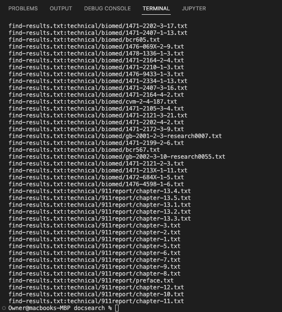

```
grep -H ".txt" find-results.txt
```
This command prints the file name headers with the output lines, as you can see in the image it says: find-results.txt:(path). When you do the same thing without the -H, we just get 


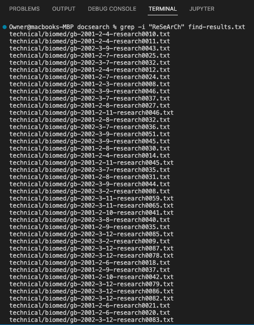

```
grep -i "ReSeArCh" find-results.txt
```
By default, grep is case sensitive,, -i makes it so whatever we looking can preform insensitive matching. You can see what happens when I search "ReSeArCh" using -i in the image above, and what happens when I search for "ReSeArCh" without -i below. 

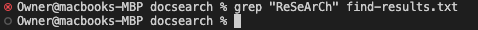


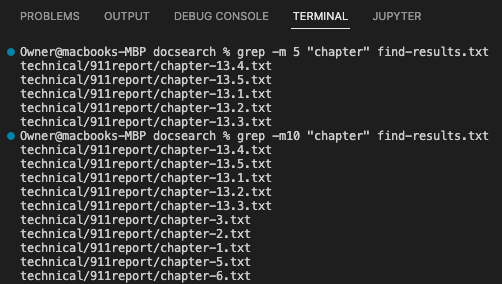

```
grep -m 5 "chapter" find-results.txt
 grep -m10 "chapter" find-results.txt 
```
This command basically stops reading the file whatever num in `grep -m num` is. This can be useful if you need or want to look through all of the file.  


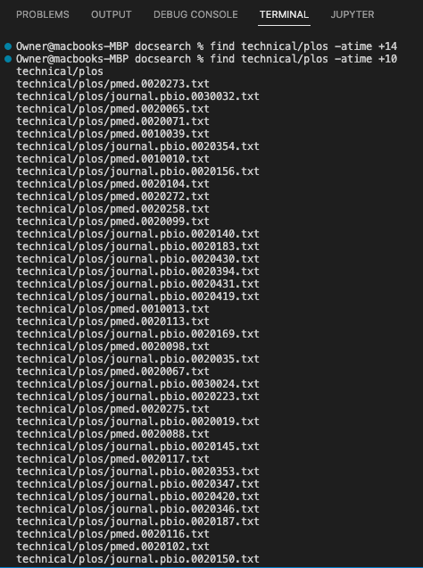

```
find technical/plos -atime +10
```
This command returns the files that were accessed `n` days ago. In this case, I searched for files that were accessed ten days ago. It's useful if you need to find files that were accessed or changed during a certain time period. 


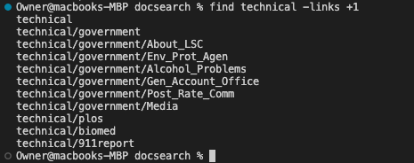

```
find technical -links +1
```
When this command is run, it returns true if the file has `n` amount of links. In this case, I decided to use directories and it return true if they contain at least one link.  


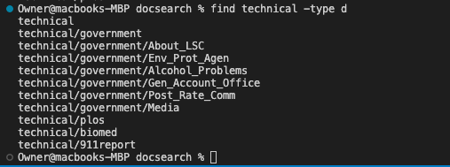


```
find technical -type d
```

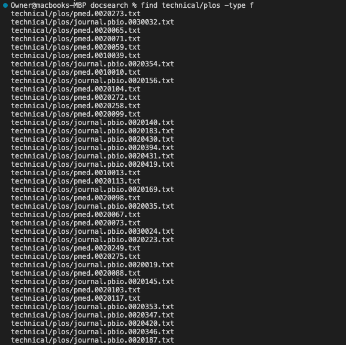

```
find technical/plos -type f
```
I did two examples of the same command above, but basically, it returns true if the type of file in the directory or file. The code itself is `find (directory or whatever you are looking in) -type t` where t is type. Possible types are:
b = block special

c = character special 

d = directory 

f = regular file

l = symbolic link

p = FIFO

s = socket 


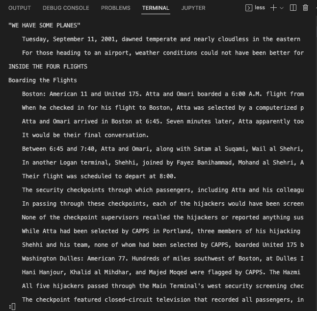


```
less -S technical/911report/chapter-1.txt
```
The above command cuts off the lines longer than the screen width. Usually, the longer lines just wrap inorder to fit the screen, but with this command, the rest of the sentence is just cut off. This is useful if you only need to see the first parts of the sentences. 


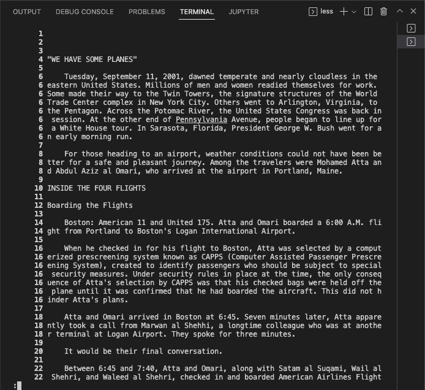

```
less -N technical/911report/chapter-1.txt
```
This command makes it so that a line number is displayed at the beginning of each line in the file content display. 


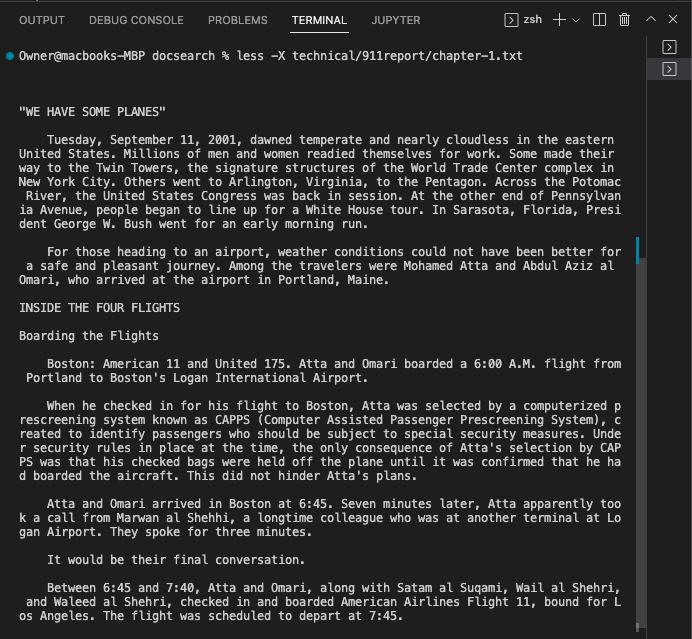

```
less -X technical/911report/chapter-1.txt
```

less-X makes it so that even after the file content display is exited, you can still see the file's content. !