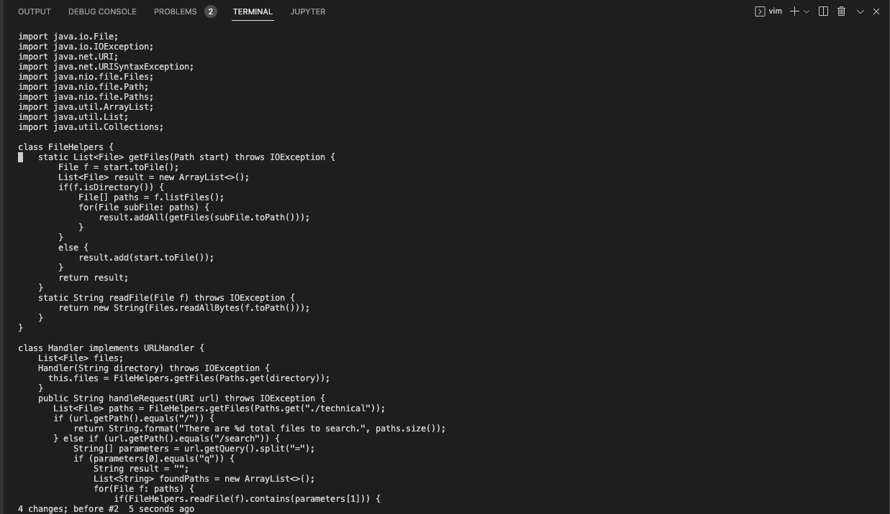
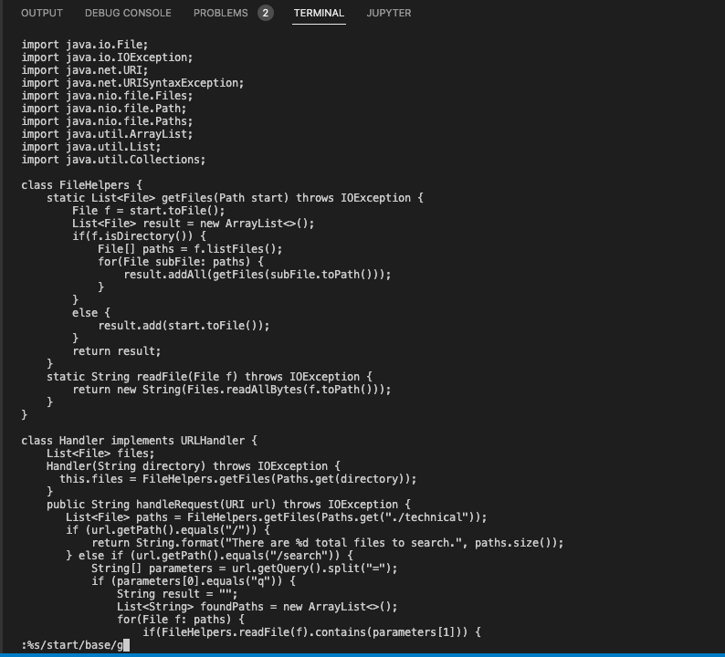
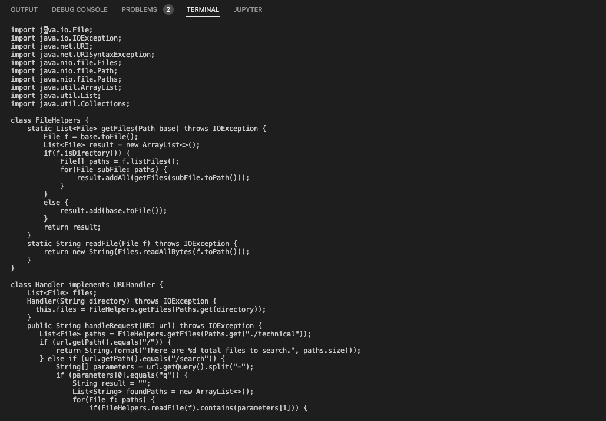

Part 1:

The task that my group decided to complete from the week 6 lab is the option of "changing the name of the start parameter and its uses to base".

The shortest sequence of vim commands that we used in order to be able to change all of instances of start into base was:

```
:%s/start/base/g<Enter>
```



In the image above, you can see what the file looked like before I made the edit in vim. 


In the image above, you can see the vim command I typed out.



In the final image above, you can see what happens after I press enter for the command we used. As you can see, all uses of start were changed into base. 

Technically it's only one command, but it still counts. The total amount of keys pressed for this command was 17 keys. We had done some researcing about different vim commands and we were able to use this structure in order to be able to change all mentions of start into base in one go. 

```
:%s/<search_string>/<replace_string>/g
```


Part 2:

Times: 

First Style: 1 min 32 sec (Took a longer time to upload file than I thought it would.)

Second Style: 45 sec

Which of these two styles would you prefer using if you have to work on a program that you were running remotely, and why?

Honestly, if I had to work on a program that I was running remotely, I would prefer to to use the second option of starting already logged into the ssh session and then just makes the edit in Vim and running it as soon as I'm able to exit vim. Even though Vim can be frustrating, the more I'm learning about it and some of the faster commands I can do and run, it's nice. I also wouldn't have to go through the hassle of having to upload it to the remote server. While I was trying out the first option of starting out in Visual Studio Code and the scp-ing the files to the remote server, that's what took up the longest time. Of course, it might of been influenced by my internet connection or other factors, but if I had a bigger repository or number of files to upload, it could take even longer and it just wouldn't be efficient. 


What about the project or task might factor into your decision one way or another? 

I think there are a few things that might factor into my decision of using one style or the other. I think the first thing would be just how many files or things I'm working with. I mentioned it above but if it's a bigger number of files and such, I probably wouldn't want to have to scp a huge number of files. I think something else that would factor into my decision would probably be how much patience I have. I think that one could lead me either way. I'm still not exactly profficient at Vim, so maybe some days I might not have the patience to deal with that and might just scp with files. On the other hand, I might not have the patience to switch from local to remote so I might just start on Vim remotely. 


