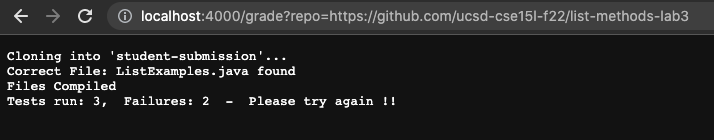
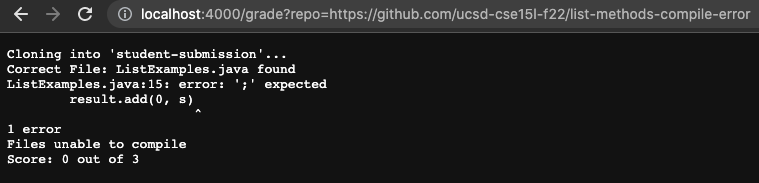
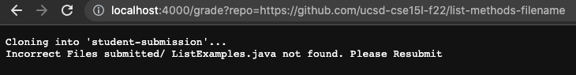
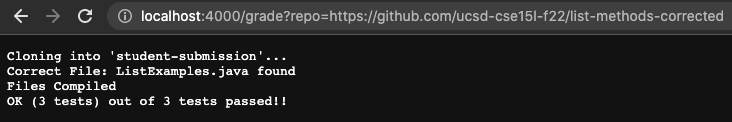

Code for Grade.sh
```

# set -e

rm -rf student-submission
git clone $1 student-submission

FILE1=ListExamples.java

cp TestListExamples.java student-submission/
cd student-submission

CP=".:../lib/hamcrest-core-1.3.jar:../lib/junit-4.13.2.jar" 

if [ -e "$FILE1" ]
then 
    echo "Correct File: $FILE1 found"
else
    echo "Incorrect Files submitted/ $FILE1 not found. Please Resubmit"
    exit 1
fi 


javac -cp $CP *.java 

if [[ $? -eq 0 ]]
then 
    echo "Files Compiled"

else
    echo "Files unable to compile"
    echo "Score: 0 out of 3"
    exit 1
fi

java -cp $CP org.junit.runner.JUnitCore TestListExamples > normal-out.txt 2> err-out.txt


if [[ $? -eq 0 ]]
then 
    grep "tests" normal-out.txt > Score.txt
    echo "$(<Score.txt)" "out of 3 tests passed!!"
else
    grep "Tests" normal-out.txt > Failures.txt
    echo "$(<Failures.txt)" " -  Please try again !!"
fi

cat err-out.txt

```


Student Submission:
[No Changes made to Starter Code](https://github.com/ucsd-cse15l-f22/list-methods-lab3)



Student Submission: [Has syntax errror of missing semicolon](https://github.com/ucsd-cse15l-f22/list-methods-compile-error)



Student Submission: [Correct Implementation saved in a file with incorrect name](https://github.com/ucsd-cse15l-f22/list-methods-filename)



Student Submission: [Correct Methods](https://github.com/ucsd-cse15l-f22/list-methods-corrected)

