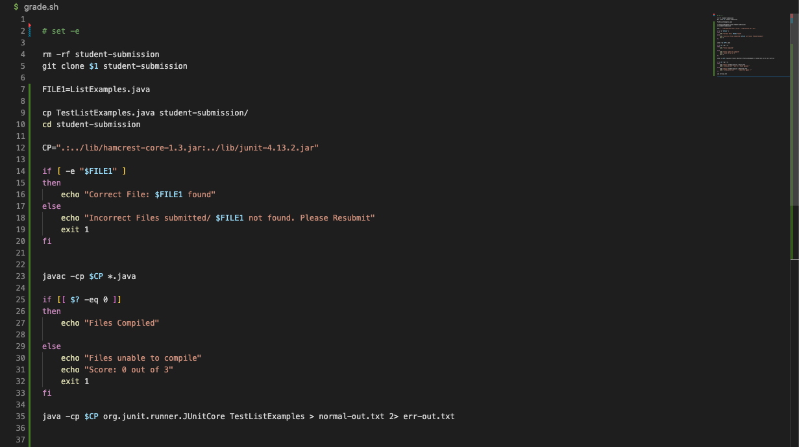
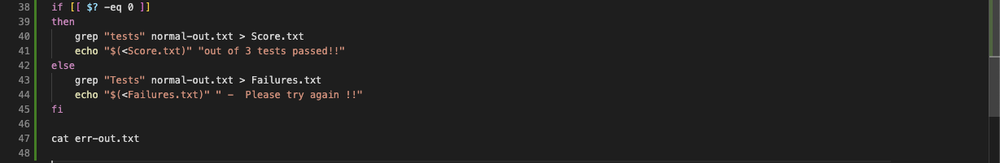

Code for Grade.sh

```
# set -e

rm -rf student-submission
git clone $1 student-submission

FILE1=ListExamples.java

cp TestListExamples.java student-submission/
cd student-submission

CP=".:../lib/hamcrest-core-1.3.jar:../lib/junit-4.13.2.jar" 

if [ -e "$FILE1" ]
then 
    echo "Correct File: $FILE1 found"
else
    echo "Incorrect Files submitted/ $FILE1 not found. Please Resubmit"
    exit 1
fi 


javac -cp $CP *.java 

if [[ $? -eq 0 ]]
then 
    echo "Files Compiled"

else
    echo "Files unable to compile"
    echo "Score: 0 out of 3"
    exit 1
fi

java -cp $CP org.junit.runner.JUnitCore TestListExamples > normal-out.txt 2> err-out.txt


if [[ $? -eq 0 ]]
then 
    grep "tests" normal-out.txt > Score.txt
    echo "$(<Score.txt)" "out of 3 tests passed!!"
else
    grep "Tests" normal-out.txt > Failures.txt
    echo "$(<Failures.txt)" " -  Please try again !!"
fi

cat err-out.txt

```


Student Submission:
[No Changes made to Starter Code](https://github.com/ucsd-cse15l-f22/list-methods-lab3)


Student Submission: [Has syntax errror of missing semicolon](https://github.com/ucsd-cse15l-f22/list-methods-compile-error)


Student Submission: [Correct Implementation saved in a file with incorrect name](https://github.com/ucsd-cse15l-f22/list-methods-filename)


Student Submission: [Correct Methods](https://github.com/ucsd-cse15l-f22/list-methods-corrected)


Tracing the Script:

For this section, I will be describing what grade.sh does with the submission with the [correct methods](https://github.com/ucsd-cse15l-f22/list-methods-corrected).

I will be using the line numbers in order to refer to the commands as stated in these provided images. The format for command stdout, stderr, and exit code follows (stdout, stderr, exit_code) for the lines with commands. (Please note that I got my answers from redirecting the outputs and errors to files that aren't shown in the code above or below because I didn't have them when I got my screenshots.)




Line 4: (none --> no output for this, none, zero) 

Line 5: ("Cloning into 'student-submission'...", none, zero) // Please not that $1 is the github link that is included when we run bash grade.sh (link).

Line 7: Creates variable called FILE1 that stands for the name of the student submitted file. 

Line 9: (none --> no output for this, none, zero)  // Successfully copies TestListExamples.java into the student-submission directory. 

Line 10: (none --> no output for this, none, zero) // Successfully changes the directory to student submission so that we can run our commands and actually test the file. 

Line 12: Creates variable with the class path needed in order to run jUnit. 

Line 14: If Statement: [ -e "$FILE1" ] --> Condition is true because for this student submission, ListExamples.java DOES exist and is in the correct directory. 

Line 15: then

Line 16: ("Correct File: ListExamples.java found", none, zero) --> Since the file does exist, the output for this is just the text being echoed. 

Lines 17 - 19: dnr (did not run) since the if statement was true and ListExamples.java does exist, these lines do not run. 


Line 23: (none, none, zero) --> The files were able to successfully compile. 

Line 25: if statement: Returns true nf the exit code for the prior command (javac) was zero (AKA: ran successfully / compiled) --> In this case, the exit code for the command above was zero, meaning that this if condition is true. 

Line 26: then

Line 27: ("Files Compiled", none, zero) --> Another echo command, this meands the out put is the text of the echo. 

Lines 29 - 32: dnr --> If the file had been unable to compile, it would've have echoed a different text and then had an early exit. 

Line 35: (JUnit version 4.13.2 ... Time: 0.019 OK (3 tests), none, zero) --> This command actually runs the jUnit tests and redircts the output to a file called normal-out.txt. In the case of any errors, the command redirects the errors to a file known as err-out.txt; Since the file is able to run properly, the exit code is also zero. 


Line 38: if statement: returns true if the exit code for the privious command is zero (AKA: java was able to run the program). In this case, the if condition is true because the examples were able to run. 

Line 39: then

Line 40: ("OK (3 tests)", none, zero) --> looks for "tests" (case sensitive) within normal-out.txt and redirects that output to Score.txt

Line 41: ("OK (3 tests) out of 3 tests passed!!", none, zero) --> echos content of Score.txt and lets you know your code had all three out of three tests pass.

Line 42 - 44: dnr --> In the case that the file had some failed tests, grade.sh owuld have grepped the line with "Tests" (case sensitive) within normal-out.txt and redirected that to Failures.txt. It then would have echoed the contents of Failures.txt as well as the text " - Please try again !!"


Line 47: (none, none, zero) (I believe that this line runs, however, since the content of err-out.txt is empty (since there weren't any errors), then there's no output or errors). In the case that there are any errors, this file would have printed the contents of the file containing the std error output of Line 35. 
